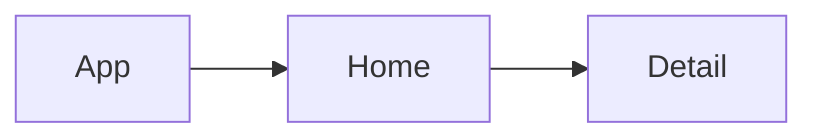

# Product Requirements Documentation

**Summary**
| Field | Detail |
|-------|--------|
| Project Name | React-Native ToDO |
| Description |Manages tasks on an android device |
| Developers | Calvin Harris |
| Live Website | https://expo.dev/@contactharrisc2/Todo-Mobile?serviceType=classic&distribution=eexpo-go |
| Repo | https://github.com/Newbclharri/React-Native-To-Do  |
| Planning | https://miro.com/app/board/uXjVPfU1C5Q=/?share_link_id=563111831555 |
| Technologies | JSX, JavaScript, React-Native, Firebase, Google Cloud, Miro, Github |

# Things I Want to Improve:
- Add authentication and authorization
- add notes on detail page
- Drag and reorder todos to dynamically prioritize
- Keep previous text during edit

# Problem Being Solved and Target Market

Quickly manage list of tasks on an android mobile device

# User Stories

- As a user, I want to view all todos
- I want to edit a todo
- I want to delete a todo

# Route Tables
|Name|Action|
|----|------|
|Home|Index|
|x|Delete|
|Detail|Edit|

# Component Architecture

## User Interface Mockups

## Home

## Detail

